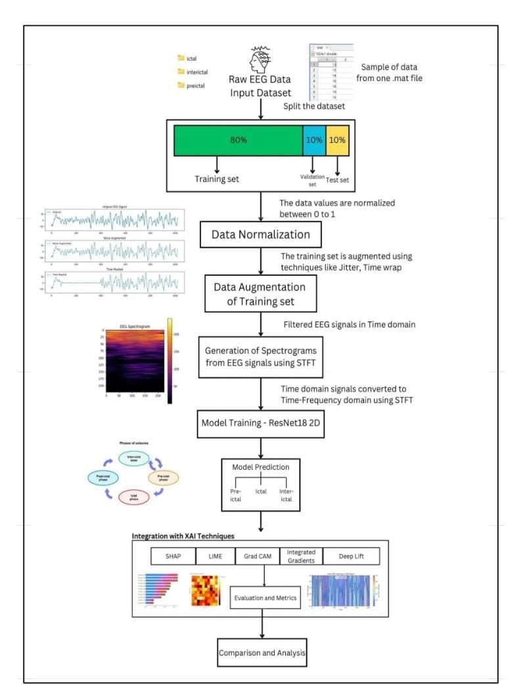

# Epileptic Seizure Prediction Using EEG Signals
### Architecture with Deep Learning and XAI

This project focuses on **epileptic seizure prediction and classification** using **EEG signal analysis**, **deep learning**, and **Explainable AI (XAI)** techniques.  
The system classifies EEG signals into **Pre-ictal, Ictal, and Inter-ictal** phases to support early seizure detection and clinical decision-making.

---

## Project Overview

Epilepsy is a neurological disorder characterized by recurrent seizures. Accurate and early prediction of seizures can significantly improve patient safety and treatment planning.

This project implements a **Phase-2 architecture** that:
- Processes raw EEG signals
- Converts signals into time-frequency representations
- Trains a deep learning model (ResNet18-2D)
- Applies XAI techniques for model interpretability

---

## System Architecture

> **Architecture for Epileptic Seizure Prediction**

---

## Workflow Description

### Raw EEG Data Input
- EEG signals collected from `.mat` files
- Contains three classes:
    - **Pre-ictal**
    - **Ictal**
    - **Inter-ictal**

---

### Dataset Splitting
The dataset is split into:
- **80% Training set**
- **10% Validation set**
- **10% Test set**

This ensures unbiased evaluation and avoids overfitting.

---

### Data Normalization
- EEG signal values are normalized between **0 and 1**
- Improves training stability and convergence

---

### Data Augmentation
To enhance model generalization, augmentation techniques are applied on the training set:
- Jittering
- Time warping
- Signal shifting

---

### Spectrogram Generation
- EEG signals (time domain) are converted into **time-frequency domain**
- **Short-Time Fourier Transform (STFT)** is used
- Produces spectrogram images for deep learning input

---

### Model Training
- **ResNet18 (2D CNN)** architecture
- Trained on EEG spectrogram images
- Learns spatial and frequency-based seizure patterns

---

### Model Prediction
The trained model classifies EEG segments into:
- **Pre-ictal**
- **Ictal**
- **Inter-ictal**

---

### Integration with XAI Techniques
To make predictions interpretable, the following XAI methods are used:
- **SHAP**
- **LIME**
- **Grad-CAM**
- **Integrated Gradients**
- **DeepLIFT**

These techniques highlight critical EEG regions influencing predictions.

---

### Evaluation & Metrics
- Accuracy
- Precision
- Recall
- F1-Score
- Confusion Matrix
- Class-wise performance analysis

---

### Comparison and Analysis
- Performance comparison across classes
- Visual analysis of XAI outputs
- Model reliability and robustness evaluation

---

## Technologies Used

- Python
- NumPy, SciPy
- Signal Processing (STFT)
- Deep Learning (ResNet18-2D)
- TensorFlow / PyTorch
- Explainable AI (SHAP, LIME, Grad-CAM)
- Matplotlib, Seaborn

---

## Key Contributions

- End-to-end EEG signal processing pipeline
- Accurate seizure phase classification
- Deep learning with explainability
- Improved trust in AI-based medical diagnosis

---

## Applications

- Epileptic seizure early warning systems
- Clinical decision support tools
- EEG-based neurological research
- Healthcare AI systems

---

## Conclusion

This Phase-2 architecture demonstrates an effective and interpretable approach to epileptic seizure prediction using EEG signals.  
By combining **deep learning** with **XAI techniques**, the system not only achieves high classification accuracy but also ensures transparency, making it suitable for real-world medical applications.

---

